# [Путешествие во времени по подземельям: Легион](https://ru.wowhead.com/event=1271)
Это особенный таймволк. Игроки, выше 50го уровня, получают доступ к забегам в скалированные инсты Легиона, но в именно в Легионном таймволке вводятся забеги в старые м+ инсты и вместо обычного скалированного рейда дополнения вы получаете доступ к башне магов.

## 🟢 Что нового?
- ХП многих боссов в м+ уменьшено
- [Безумный рев](https://ru.wowhead.com/spell=200580/) [Гноешкурого гризли](https://ru.wowhead.com/npc=95779/) наносит на 30% меньше урона.
- Урон [Взрывчатой лунной глефы](https://ru.wowhead.com/spell=197513/) [Корданы](https://ru.wowhead.com/npc=95888/) уменьшен на 60%
- Аффиксы этой недели:  
💥 <a href="https://ru.wowhead.com/affix=9"> Тиранический</a>  
💥 <a href="https://ru.wowhead.com/affix=11"> Взрывной</a>  
💥 <a href="https://ru.wowhead.com/affix=3"> Вулканический</a>  
💥 <a href="https://ru.wowhead.com/affix=129"> Инфернал</a>  

## 🟢 Мифик инсты

В этот раз игроки могут пройти м+ версии инстов. Для этого надо поговорить с [Та'сап](https://ru.wowhead.com/npc=178804) возле хранилища в Орибосе и получить [Старый ключ](https://ru.wowhead.com/item=187786), разблокирующий м+ сложность. Лут из М+ Легиона подчиняется тем же правилам что и мифики ШЛ, максимальный дроп 262го илвла с 15+ с вожмостью апнуть до 272го [доблестью](https://ru.wowhead.com/currency=1191). Закрытые м+ инсты легиона влияют на счет недельных пройденных ключей.  

## 🟢 Башня магов
Во время Легионной недели игрокам будет доступна Башня Магов. Прохождение башни даст вам следующие награды:

• Ачивку [На вершине успеха](https://ru.wowhead.com/achievement=15309) и расцветку 20го тира для вашего класса.  
• Мишки закрывшие башню получат новую расцветку для артефактного облик медведя.  
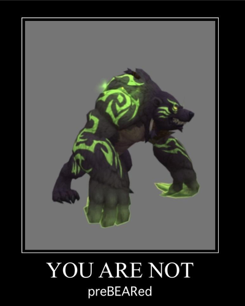  
• Завершив все 7 испытаний башни вы получите ачивку [Семь башен – уже замок](https://ru.wowhead.com/achievement=15310) и маунт [Зачарованная книга заклинаний](https://ru.wowhead.com/item=188674).  
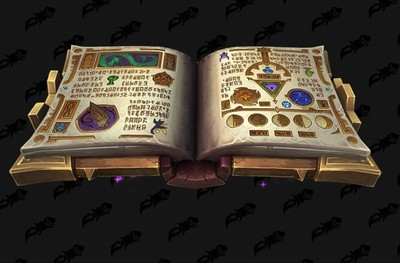  
• Завершив все испытания башни на всех спеках всех классов вы получите ФоС ачивку [Штурм башни](https://ru.wowhead.com/achievement=15308).

## 🟢 Доступные инсты
Будут доступны 6 инстов Легиона:  
• [Крепость Черной Ладьи](https://ru.wowhead.comhttps://www.wowhead.com/black-rook-hold-dungeon-strategy-guide), 30 [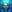](https://ru.wowhead.com/currency=1166) за прохождение.  
• [Квартал Звезд](https://ru.wowhead.comhttps://www.wowhead.com/court-of-stars-dungeon-strategy-guide), 25  за прохождение.  
• [Чаща Темного Сердца](https://ru.wowhead.comhttps://www.wowhead.com/darkheart-thicket-dungeon-strategy-guide), 30  за прохождение.  
• [Око Чаек](https://ru.wowhead.comhttps://www.wowhead.com/eye-of-azshara-dungeon-strategy-guide), 35  за прохождение.  
• [Логово Нелтариона](https://ru.wowhead.comhttps://www.wowhead.com/neltharions-lair-dungeon-strategy-guide), 30  за прохождение.  
• [Казематы Стражей](https://ru.wowhead.comhttps://www.wowhead.com/vault-of-the-wardens-dungeon-strategy-guide), 35  за прохождение.  

В инстах падает гир уровнем 184 и выше.

## 🟢 Баджи
Основная валюта таймволков [Искаженный временем знак ](https://ru.wowhead.com/currency=1166) добывается в инстах, в первом же забеге вам с высокой вероятностью выпадет квестовый предмет, сдав который вы получите 500 знаков, далее вы получаете 5 знаков за каждого босса инста, 10 за ласта и 10 за окончание инста.

За баджи на этой неделе вы сможете купить у [Аридорми](https://ru.wowhead.com/npc=180899/):

### 🟢 Гир
Весь гир за баджи имеет 164илв.

**Ткань**  
• [Нар'таласская церемониальная туника](https://ru.wowhead.com/item=187579) - 25   
• [Нар'таласские церемониальные бриджи](https://ru.wowhead.com/item=187580) - 25   
• [Нар'таласское оплечье](https://ru.wowhead.com/item=187581) - 35   
**Кожа**  
• [Нагрудник из шкуры торигнира](https://ru.wowhead.com/item=187582) - 25   
• [Штаны из шкуры торигнира](https://ru.wowhead.com/item=187583) - 25   
• [Наплеч из шкуры торигнира](https://ru.wowhead.com/item=187584) - 35   
**Кольчуга**  
• [Кираса стража силовых линий](https://ru.wowhead.com/item=187585) - 25   
• [Наголенники стража силовых линий](https://ru.wowhead.com/item=187586) - 25   
• [Оплечье стража силовых линий](https://ru.wowhead.com/item=187587) - 35   
**Латы**  
• [Нагрудный доспех элитного бойца Черной Ладьи](https://ru.wowhead.com/item=187588) - 25   
• [Нагрудный доспех элитного бойца Черной Ладьи](https://ru.wowhead.com/item=187588) - 25   
• [Наплечные пластины элитного бойца Черной Ладьи](https://ru.wowhead.com/item=187590) - 35   

**Оружие\Щиты**  
• [Щит сурамарского стражника](https://ru.wowhead.com/item=187563) - 35   
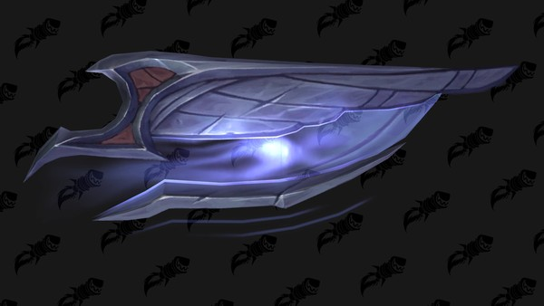  

• [Дуговой щит ночнорожденных](https://ru.wowhead.com/item=187564) - 35   
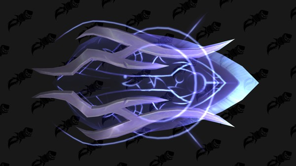  

• [Длинный лук Защитников Аргуса](https://ru.wowhead.com/item=187565) - 100   
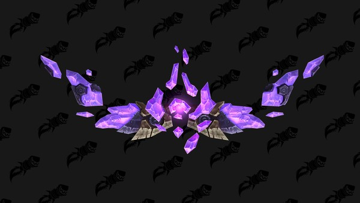  

• [Дуговой крушитель](https://ptr.wowhead.com/item=187568) - 50   
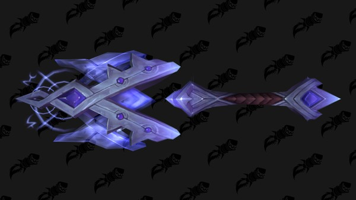  

• [Duskwatch Arcblade](https://ru.wowhead.com/item=187568) - 50   
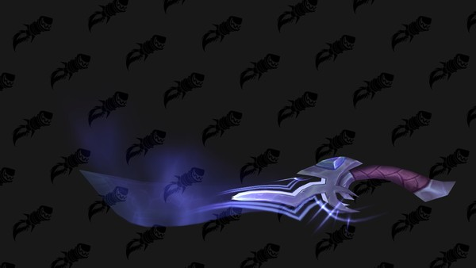  

• [Посох исказителя](https://ru.wowhead.com/item=187578) - 100   
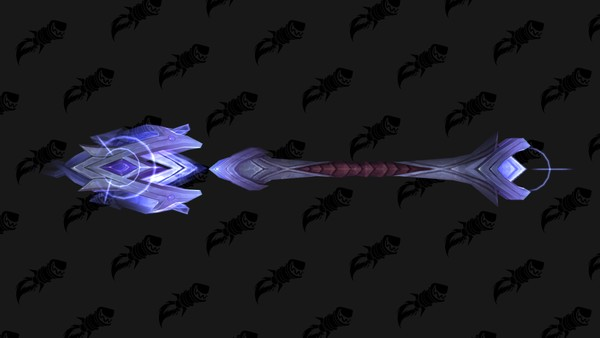  

### 🟢 Косметика

[Копия эгиды Агграмара](https://ru.wowhead.com/item=187562) - 300   
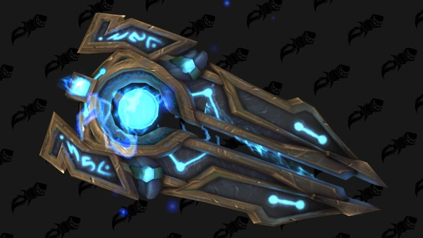  

[Комплект: боевой доспех Гребня Ворона](https://ru.wowhead.com/item=188209) - 500    ([Примерить](https://ru.wowhead.comhttps://ptr.wowhead.com/dressing-room#dm0z0zM89c8H8by8F8Mjq8J8bZ8K8MLw8bK808bO808O808S8dn8U8dH8bJ8MAL8bC8MAM8bQ8MA48qO8Mfk8bg8MNf8bv8MNl8on8df8Q8MLQ8sK8z2i8aP8Mkw8f28meN8qV8Msc8a38MRT8qz8MRJ87r32Z8083Oh87c3Ow87V3248083238083218083Oi80832287q)): Сет доступен только латным классам.
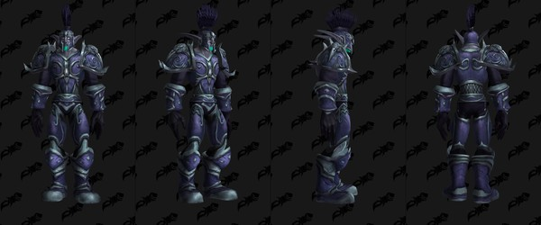  

### 🟢 Фамильки
Традиционно продаются и улучшения для фамилек:  
• [Старинная наследная обшивка для брони](https://ru.wowhead.com/item=122338): 750   
• [Старинные наследные ножны](https://ru.wowhead.com/item=122339): 900   
• [Видавшая виды наследная обшивка для брони](https://ru.wowhead.com/item=122340): 1000   
• [Видавшие виды наследные ножны](https://ru.wowhead.com/item=122341): 1200   
• [Обветренная наследная обшивка для брони](https://ru.wowhead.com/item=151614) - 1000   
• [Обветренные наследные ножны](https://ru.wowhead.com/item=151615) - 1200   
• [Закаленная в бою наследная обшивка для брони](https://ru.wowhead.com/item=167731) - 1000   
• [Закаленные в бою наследные ножны](https://ru.wowhead.com/item=167732) - 1200   
• [Вечная наследная обшивка для брони](https://ru.wowhead.com/item=187997) - 1000   
• [Вечные наследные ножны](https://ru.wowhead.com/item=187998) - 1200   

### 🟢 Маунты

[Гиппогриф Валь'шары](https://ru.wowhead.com/item=187595). новый оттенок гиппогрифа 5000 .  
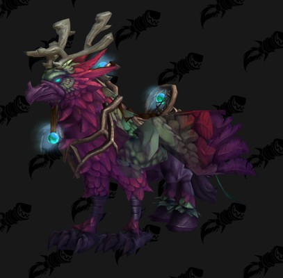 

[Поводья попирателя времен из рода Бесконечности](https://ru.wowhead.com/item=133543): дроповый дракон таймволков.  
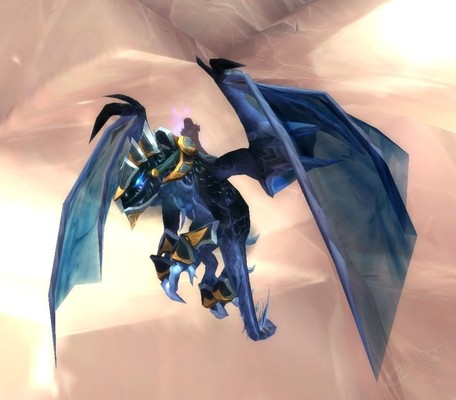

### 🟢 Токены на репутацию
Введы токены репутации со фракциями легиона, эти токены дают по 250 репутации и привязываются к учетной записи. 

• [Знак двора Фарондиса](https://ru.wowhead.com/item=146943) - 50   
• [Знак Ткачей Снов](https://ru.wowhead.com/item=146942) - 50   
• [Знак племен Крутогорья](https://ru.wowhead.com/item=146944) - 50   
• [Знак валарьяров](https://ru.wowhead.com/item=146941) - 50   
• [Знак Стражей](https://ru.wowhead.com/item=146945) - 50   
• [Знак помраченных](https://ru.wowhead.com/item=146946) - 50   
• [Знак Армии погибели Легиона](https://ru.wowhead.com/item=146950) - 50   
• [Знак различия Защитников Аргуса](https://ru.wowhead.com/item=152960) - 50   
• [Знак различия Армии Света](https://ru.wowhead.com/item=152957) - 50   

Репутация с этими фракциями дает:  
• Уважение с [Двором Фарондиса](https://ru.wowhead.com/faction=1900), почтение с [Помраченными](https://ru.wowhead.com/faction=1859) и [Валарьярами](https://ru.wowhead.com/faction=1948) требуются для выполнения квестчейна [Баланс сил](https://ru.wowhead.com/quest=43533), длинной цепочки квестов на разблокировку обликов артефакта.  
• Почтение с [Двором Фарондиса](https://ru.wowhead.com/faction=1900), [Ткачами Снов](https://ru.wowhead.com/faction=1883), [Племенами Крутогорья](https://ru.wowhead.com/faction=1828), [Валарьярами](https://ru.wowhead.com/faction=1948), [Помраченными](https://ru.wowhead.com/faction=1859) и [Стражами](https://ru.wowhead.com/faction=1894) необходимы для ачивки [Дипломат Расколотых островов](https://ru.wowhead.com/achievement=10672), который входит в метаачивку [Первопроходец Расколотых островов, часть 1](https://ru.wowhead.com/achievement=11190).  
• Почтение с [Армией погибели Легиона](https://ru.wowhead.com/faction=2045) необходимо для ачивки [Командир Армии погибели Легиона](https://ru.wowhead.com/achievement=11545), входящей в [Первопроходец Расколотых островов, часть 2](https://ru.wowhead.com/achievement=11446).  

### 🟢 Игрушки
• [Бдительность стража ночнорожденных](https://ru.wowhead.com/item=187591) - *Использование: Заставляет вас подозрительно относиться к окружающим. Время восстановления для ночнорожденных уменьшено. (3 Мин Восстановление)* 1500 

---
[Арт](https://www.artstation.com/artwork/8nobG) от [Christopher Hayes](https://www.artstation.com/craze)  
#news #guide #legion #timewalk #weekly