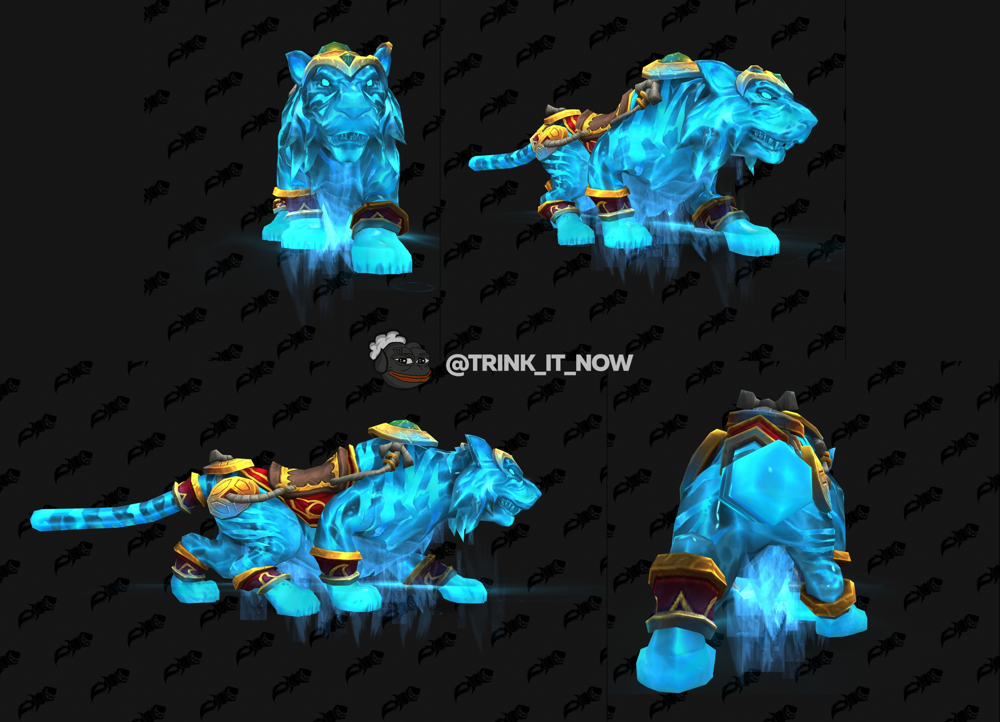
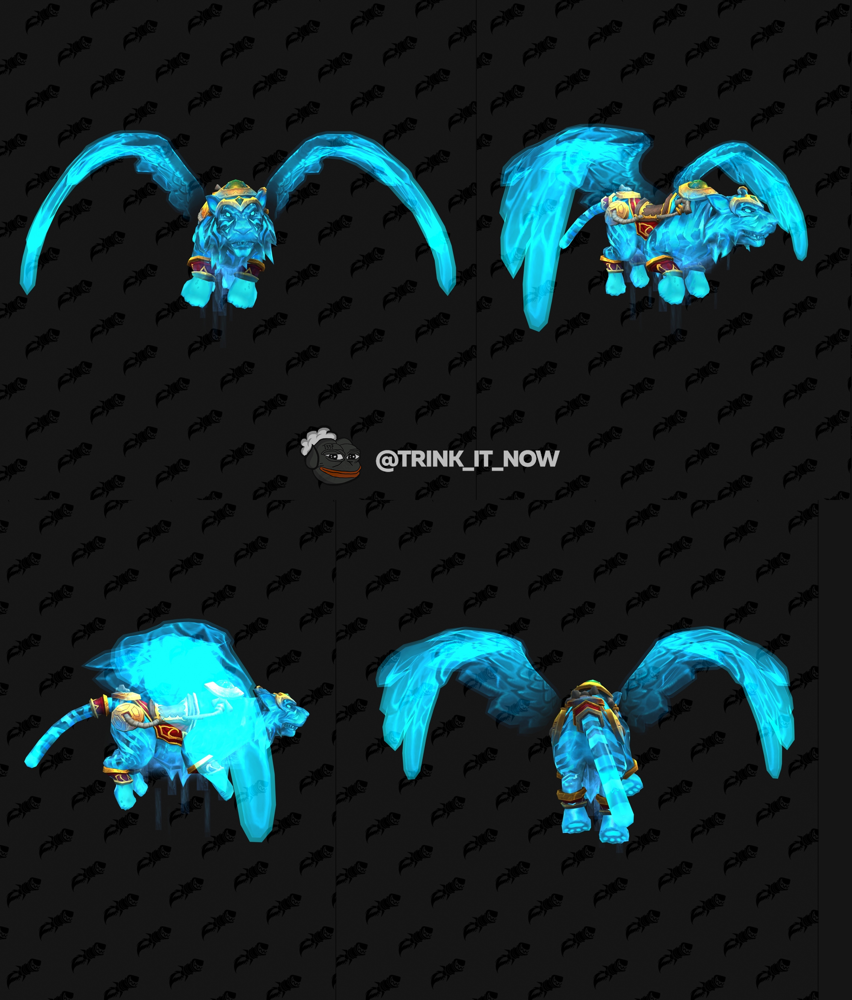
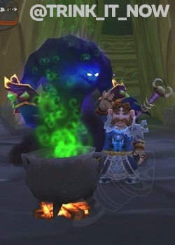
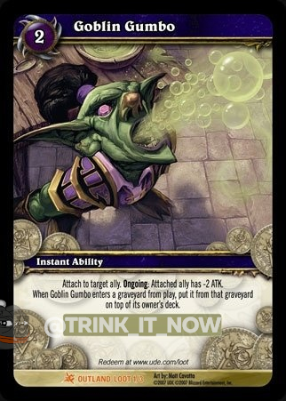

# Новый маунт за 6месячную подписку

В магазине Blizzard появился новый маунт Вэнь Ло, Берег Реки, помимо [обычного покупного маунта за 1099 рублей](https://eu.shop.battle.net/ru-ru/product/world-of-warcraft-mount-wen-lo), он также участвует в акции полугодовой подписки. [Полгода подписки](https://eu.shop.battle.net/ru-ru/product/world-of-warcraft-subscription) обойдутся вам в 3499 рублей и в тигр уже в комплекте.  
Также в комплекте имеется игрушка [Бочонок гоблинской каши](https://ru.tbc.wowhead.com/item=33219). Игрушка ставит котелок с подозрительно зеленым варевом и имеет шанс спровоцировать зеленую рвоту у вкусившего сей деликатес. Игрушка является копией такой же игрушки времен БыКа, которая выпадала в колодах карт Fires of Outland

 |  |  | 

*\* тигр активен только в актуальной версии игры  
*\* Бочонок гоблинской каши активен только в TBC