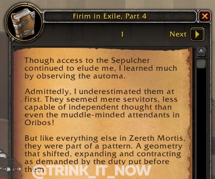

# PTR: Секреты Предвечных и План Зоваала (спойлеры)

 

Все в обновлении 9.2 посвящено секретам. Поиски загадок, расследование секретов, расшифровка шифров. Неудивительно что и цепочка квестов [Фирима](https://ptr.wowhead.com/npc=181561/) посвящена поиску фрагментов книги "Фирим в изгнании", из этой книги мы можем подчерпнуть многие истории об изгнании Фирима, о строении роботов Зерет Мортиис и даже о планах Зоваала.  

Поиск частей книги на данный момент входит в состав полетной ачивки [Unlocking the Secrets](https://ptr.wowhead.com/achievement=15514) и для любителей лора эта книга представляет значительный интерес.

Читать далее...

## Наш первый диалог с Фиримом и Пелагием:  

**Фирим:** *Я знаменитый Фирим, вы наверняка слышали о моей экспедиции по поиску Зерет Мортиис.*  
**Пелагий:** *Боюсь что не слышал. Но брокеры в Бастионе упоминали одну экспедицию которая давным давно затерялас.*  
**Фирим:** *Затерялась? Вовсе нет! Я успешно разыскал этот мир знаний и чудес. Мир умиротворения... пока не напали Верные Утробе.*  
**Пелагий:** *Но где Верные Утробе? Они тут?*  
**Фирим:** *Силы Тюремщика расползлись по Зерет Мортиису как тараканы. Не сомневаюсь что они ищут вход в Гробницу.*  
**Фирим:** *Ведь внутри хранятся секреты мироздания. Будь начеку! Агенты Зоваала могут быть повсюду...*  
**Пелагий:** *Что за конструкты тут повсюду?*  
**Фирим:** *Они называются Автомами. Они обслуживают Зерет Мортиис, покинутый Предвечными.*  
**Фирим:** *Если ты поможешь мне обуздать их силу, я пожалуй смогу придумать как использовать ее против Верных.*  

## ## Firim in Exile, Part 1: A memoir of sorts
As my exile begins, I cannot help but think back on the events that led to our arrival.

They doubted me. Mocked me. Conspired to replace me. Yet just as they unsheathed their blades of doubt and skulked forward to strike me down, it happened.

The geometry revealed itself! The fractals aligned! At long last, I found the way to Zereth Mortis!

No other mind could conceive the formulae required to succeed. Portal after portal, tuned and re-tuned, stretching out and looping back upon themselves. No wonder so many before me had failed!

The fools among our expedition rushed to plunder the land's mysteries and paid the price for their folly. Did I not insist that the First Ones would not leave their secrets unguarded?

The survivors learned their lesson and heeded my warnings.

We found a safe foothold. A haven from which our work began.

But our fragile harmony would not endure.

## Firim in Exile, Part 2: A testament to a singular intellect
The deeper we delved into the mysteries of Zereth Mortis, the more my colleagues became affected.

Even Executor Al'kreth, perhaps the most glory-driven of anyone in the expedition, began to regard the knowledge we gleaned as sacred.

In time, Al'ara and the others perceived the great truth: we could not send word of our discoveries back to the Overseer. The secrets of the First Ones were not to be plundered! Outsiders would only disrupt the crucial purposes of Zereth Mortis.

We shattered our portals, I blotted out my translocation equations, even from my own mind. Any temptation that might lead us back to the outer realms was forfeit.

Our hearts sang as we renounced our cartel designations! From that day forth, I was simply Firim. And while I did not seek to profit from the Progenitor's knowledge, I did want to understand it.

This is where the schism began.

## Firim in Exile, Part 3: A victim of lesser intellects
Why had I been burdened by the company of minds so small?

Even in a land of infinite wonder, the dullards who worked alongside me in Haven failed to appreciate the purpose that drove my every thought and deed.

I had to reach the Sepulcher.

It was blasphemy, they claimed. The mysteries there were too sacred. Truths not to be approached, or even pondered.

They labeled me a heretic. When my back was turned, they sabotaged my research. Just as I neared the translation of a new cypher, Kreth would send some meddling pilgrim to interfere.

Our bigger feud stretched on and became irreconcilable. Finally they declared me an apostate and banished me from Haven--the very foothold I had given them!

Still, I bore this indignity in a manner befitting one of my intellect and resolve. In exile, I would outpace them all.

And so I did.

## Firim in Exile, Part 4: Of automa, and realizations
Though access to the Sepulcher continued to elude me, I learned much by observing the automa.

Admittedly, I underestimated them at first. They seemed mere servitors, less capable of independent thought than even the muddle-minded attendants in Oribos!

But like everything else in Zereth Mortis, they were part of a pattern. A geometry that shifted, expanding and contracting as demanded by the duty put before them.

After all, this land is no museum; no library of obscurities. No, it is a workshop. A forge where afterlives are fashioned.

When I detached my consciousness from the limitations of perception, I saw the grand architecture of the Progenitors put into practice. Afterlives assembled according to the needs of the Arbiter's judgments.

It was the automa who carried out these duties, forging flora, fauna, and terrain, encasing them in orbs to be sent out into the In-Between like seeds falling into fertile soil.

Do you see? Do you understand as I do?

Everything about the Shadowlands--everything!--is part of the pattern. A closed system in which nothing is lost. Even that which is seemingly destroyed is merely being reshaped for a new purpose.

Purpose. Hmm. Myopic though they are, perhaps the attendants understand some small measure of this mystery.

## Firim in Exile, Part 5: The cyphers and the greater mysteries
I observed many types of automa of varied sizes and shapes. Guardians, builders, collectors--and a more petite variety that seemed to revel in duties of upkeep and repair.

Besides an unwavering devotion to their obligations, these automa shared another notable trait: their language. They spoke not in words I could understand, but in tones and echoes.

Know that I, Firim, am renowned for my linguistic skills. Though arrival in the Shadowlands imbues mortal souls with a knowledge of the words of Death, many retain the memories of the languages they used on their worlds.

And what is language if not a system of sounds and patterns, I ask you?

So yes, of course I had absorbed countless languages during my interviews of mortal souls. Thus you will understand my confidence that the language of the automa would pose little challenge.

Never in my existence had I been so wrong.

The language of the Automa was not merely words. No! It was part and parcel of the cyphers! The words themselves were keys to understanding the geometry. The fractals.

There was so much waiting to be discovered. But it was when I encountered one of the rarest forms of automa that my mind was truly opened.

## Firim in Exile, Part 6: You may hear the song, but you will not understand it
Automa were commonplace in Zereth Mortis. But not all types. One was exceedingly rare, like polished jewels among infinite grains of sand.

The oracles.

They sang songs to their kin, and so at first I thought they were unique only in appearance. But as I drew close to one to better observe its duties, something unexpected happened.

I heard its voice.

And yet the term "voice" falls short. I experienced the sensation of words being spoken in much the manner one does when conversing with a colleague. And yet this was more.

I felt the words as much as heard them. The thoughts entered my consciousness and conveyed their meaning to my entire being.

What words did it offer? It spoke images. Riddles. Prophecies. And as they reverberated through my very core, I remember my conversations with Irik-tu and the thousand truths they told me of.

Then it struck me. The oracles spoke in both one truth and a thousand. Not as separate thoughts, but as one in the same instant.

And if the oracles, entities left behind to oversee a workshop, could think in such terms, how much more complex must the minds of their makers be?

Long have I scoffed at what I learned of the void lords, or demons of the Nether. I held Death's pantheon in higher regard, but now I know that they are just as limited. Truth lies in not one direction or another, but in their intersection.

The First Ones have parceled out their gifts, but gave no child all of them. No wonder these offspring bickered with such incessant jealousy. Their very nature was one of denial.

At this realization I lost consciousness, for I had once again transcended into a new plane of thought.

## Firim in Exile, Part 7: Ponder the revelations and you will know fear
Every new discovery in Zereth Mortis drew me back to the mysteries of the First Ones. I sought to understand their nature, yet each time I believed I was nearing an answer, I found myself drifting further away.

I considered again their design. The Pattern. Lines and curves, arcs and angles.

And turns. Oh, so many turns.

The six forces that pointed towards a seventh, and yet denied it. For a long while I considered this seeming contradiction no more than another variable. An unknown waiting to be solved.

But the song of the oracle continued to reverberate in my consciousness. And as I was allowed my focus to soften, my grip upon the tangible to loosen, the geometry took shape in my mind.

It was both six AND seven. The six were one, and the seventh the other.

Did they desire union? The song seemed to say otherwise. Both were, yet only one could be.

The melody shifted. I shuddered at the shape it took.

This was not a variable to be solved. It was a solution awaiting its opportunity.

The song must not be allowed to end.

Do the First Ones still sing it? Truly, I do not know. But if they do not...

If they do not...

Who will?

## Firim in Exile, Epilogue: Addendum: Ruminations upon the fragility of all things
Though the Jailer has been defeated and the Shadowlands made whole again, I find myself unable to celebrate these victories.

For I have studied the inner workings of the Sepulcher. Seen the powers with which the Jailer sought to remake reality. And these observations fill me with a fear that shakes the very core of my being.

It is clear to me now that there must be a Zereth for each force of the cosmos, and within them, an inner sanctum akin to the Sepulcher.

And if that is true, then these sanctums must be connected on some fundamental level; a connection that the Jailer sought to exploit.

What he began in the Sepulcher was meant to cascade outward from one Zereth to the next, until all were dominated by his power. The heart of the Shadowlands acting as a doorway to the heart of each cosmic force in turn, one after another bound to his will.

But if his scheme was thwarted, then why is my mind so ill at ease?

Because I have seen how fragile the pattern is. How delicate the scales that keep the six forces in balance.

And if the Jailer, in his act of malevolence, left behind but the most imperceptible of cracks in that pattern, then I fear what is tiny now will only grow, until the balance itself is prone to be shattered by another force applying relentless pressure.

I pray that the First Ones anticipated such an eventuality. That they would leave measures in place to preserve their grand design.

Unless...

Unless their design was never meant to endure.

And that... is the possibility that haunts me.