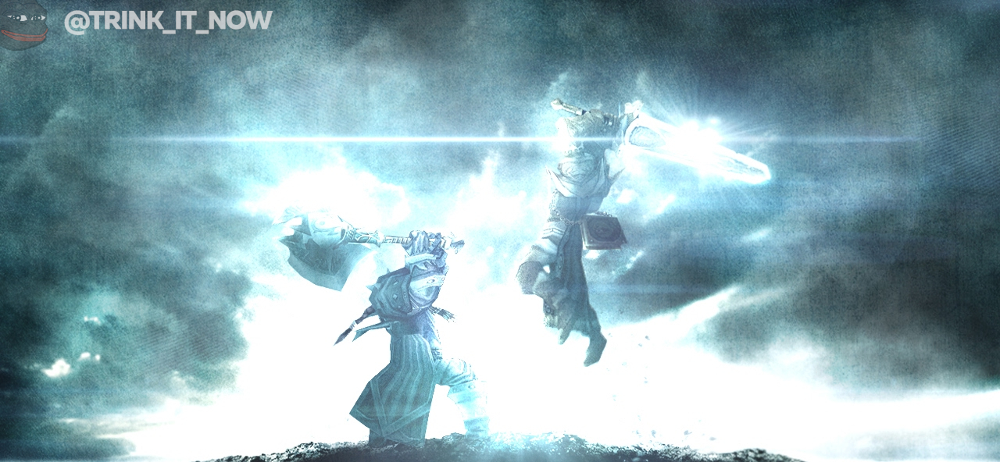

# TBC: Изменения цен и наград пвп гира

Близзард опубликовали [блюпост](https://us.forums.blizzard.com/en/wow/t/1167658/2), в котором они оповещают о изменении аспектов пвп гира в новой третьей фазе, которая стартует завтра. Игроки остались не очень удовлетворены снижением цен пвп гира так что в третьей фазе применятся следующие изменения:
- Для приобретения фракционного гира теперь достаточно Уважение (было Почтение).
- Покупка гира первого сезона не требует баджей с бг.
- Покупка гира Воздаятеля потребует вдвое меньше баджей бг.
- Бонусный хонор с дейликов увеличится.
- Дейлик [К оружию!](https://ru.tbc.wowhead.com/quest=678/) будет давать три баджа бг и призовой хонор увеличен.
- [Защита Халаа](https://ru.tbc.wowhead.com/quest=11502), [Штурмовые укрепления](https://ru.tbc.wowhead.com/quest=10110) и [Духи Аукиндона](https://ru.tbc.wowhead.com/quest=11505) станут приносить больше хонора.
- Токены T4 и T5 можно будет обменять на гир первого и второго сезонов у вендоров продающих сеты.