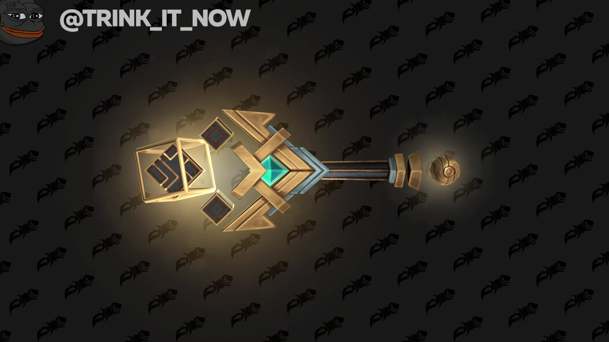
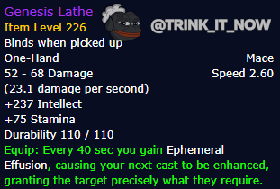

# Обзор Резца Творения

На этой неделе разработчик Scariizard [поделился мыслями](https://ptr.wowhead.com/news/blizzard-on-higher-item-level-weapons-from-raid-design-philosophy-no-weapon-325723) на тему дропа пух в рейдах и выделил особенно что не все хилы смогут получить бисовую пуху из Гробницы. Но он уточнил что для них будет доступен специальное 1H оружие, [Резец Творения](https://ptr.wowhead.com/item=189754/genesis-lathe). Мы пригласили Voulk, эксперта в хиловском теорикрафтинге, чтобы он в деталях разъяснил суть этого оружия.  

## Об авторе
Voulk автор сайта [Questionably Epic](https://questionablyepic.com/), теорикрафтерского ресурса для хилов. Он также является автором [QE Live](https://questionablyepic.com/live/), программы для рекомендаций и симуляции хилерского гира и мода [Dungeon Tips](https://www.curseforge.com/wow/addons/qe-dungeon-tips).  

*\* Отхил [Резец Творения](https://ptr.wowhead.com/item=189754/genesis-lathe) был усилен на 400-500% в сборке PTR этой недели. В этой статье описана версия оружия после баффа.*  

## Что же делает Резец Творения?
  

*Granting the target exactly what they require*(дает таргету именно то что ему нужно) это конечно звучит заманчиво но крайне непонятно. Эффект на самом деле зависит от количества хп которое было у таргета в момент триггера эффекта (о триггерах чуть ниже). Вот три примера действия эффекта:

- Если у цели больше 90% хп: 10секундный абсорб на 11-13К + 20секундный +10% бафф к скорости.
- Если цель между 40% и 90% хп: 5секундный хот на 11-13К + 20секундный +10% бафф к личу.
- Если цель ниже 40% хп: Флешка на 11-13К + 20секундный +7.5% бафф к избеганию.

## Как триггерится эффект резца?
Триггер определяется иконичными спеллами вашего спека:

<li>Рдру: <a href="https://ru.wowhead.com/spell=8936/"> Восстановление</a></li>
<li>Монк: <a href="https://ru.wowhead.com/spell=124682/"> Окутывающий туман</a></li>
<li>Ршам: <a href="https://ru.wowhead.com/spell=8004/"> Исцеляющий всплеск</a></li>
<li>ДЦП: <a href="https://ru.wowhead.com/spell=186263/"> Темное восстановление</a></li>
<li>Холик: <a href="https://ru.wowhead.com/spell=2061/"> Быстрое исцеление</a></li>
<li>Хпал: <a href="https://ru.wowhead.com/spell=19750/"> Вспышка Света</a></li>

Некоторые из этих спеллов достаточно часто встречаются в ротации хилов, но не в случае например монков или палов.

## Цифры и факты
- Грубо говоря смена пухи обойдется вам в 75-89 очков вторичных стат (в зависимости от илвла до смены оружия, разумеется) и это приведет максимум к 2.5% потерям в отхиле\дамаге.
- Прок нового оружия раз в 40 секунд.
- Каждый прок намазывает по 11-13К отхила

Прежде чем судить по итогу стоит помнить что ценой низких потерь хпса\дпса от смены оружия мы получаем где то +300 хпса, если будем придерживаться ритма кулдаунов\проков нового оружия. При среднем выхлопе хила в гере Гробницы примерно в 12к хпса мы получим 2-2.5 процента к хпсу проками и бонусные третичные статы. Единственный непонятный пока момент это как поведет себя пуха в ситуациях с высоким входящим уроном.

И не стоит разумеется недооценивать плюсы третичных стат. И хотя лич или избегание не видны в логах - они часто позоляют выжить в бою. Кроме разумеется скорости, но учитывая ориентацию прока скорости именно на слабый урон (который не ниже 90%ХП) - она и вреда не наносит.

По итогу, без практической симуляции оружие как раз представляет собой ровно то для чего оно и планировалось - добротной заглушкой слота хилу до получения бисовой пухи.