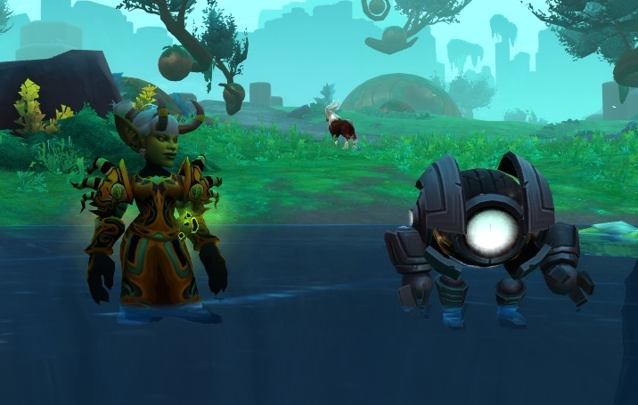
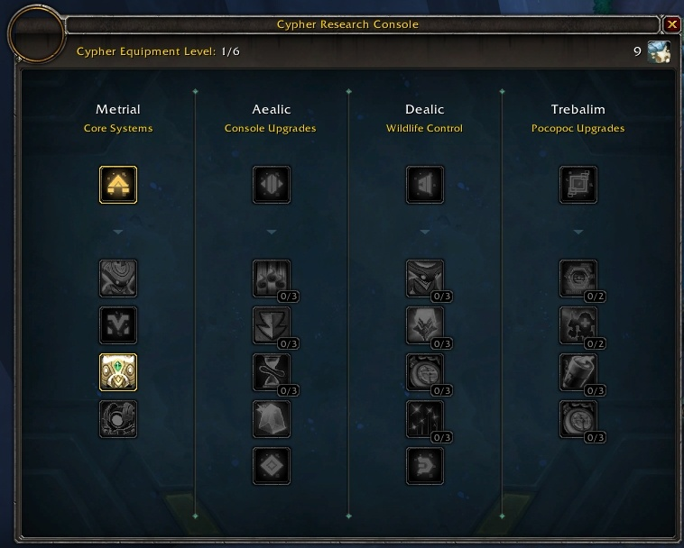
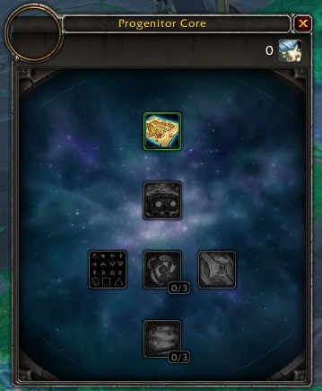
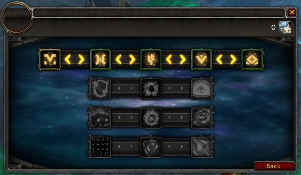
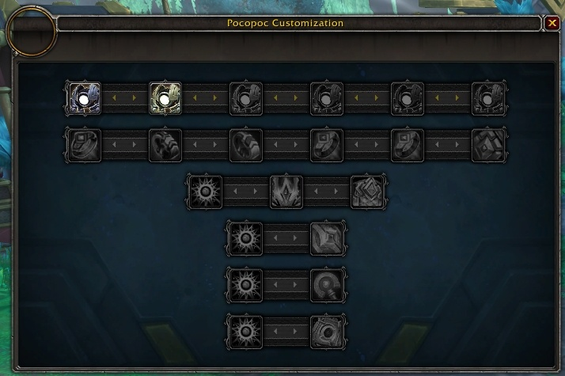

# Шифр Предвечных

Шифр предвечных одна из ключевых механик патча 9.2, она используется для исследования Зерет Мортис и включена благодаря Покопоку. В текущем виде Шифр **НЕ** предлагает игроку преимущества в PvP, инстах и рейдах.

## Что за Покопок?
Покопок это дружественный спутник игрока, полученный от [Фирима](https://ptr.wowhead.com/npc=181561) в 3й главе, [Forming an Understanding](https://ptr.wowhead.com/storyline/forming-an-understanding-1250), по ходу квеста [Cyphers of the First Ones](https://ptr.wowhead.com/quest=64230). Этот квест познакомит вас с Шифром и даст первый талант Шифра - [Metrial Understanding](https://ptr.wowhead.com/order-advancement=1901). После получения Покопока у вас появится абилка [Summon Pocopoc](https://ptr.wowhead.com/spell=360078).
 
  

## Собственно Шифр
Ниже перечисленны особенности Шифра но имейте ввиду что механики 9.2 на данный момент **находятся в разработке** и большинство фич даже не на PTRе и возможно многие аспекты изменятся, как это обычно и бывает на PRT.

• Шифр предназначен для исследования Зерет Мортис и не предоставляет никаких преимуществ в инстах или пвп. И следовательно любители проклинать близзов за гринд "ненужного" могут его просто скипать.  
• Добавлена новая валюта . В данный момент известные источники её получения это дейлики у [Фирима](https://ptr.wowhead.com/npc=181561), в локации с которым и находятся консоли для работы с Шифром.  
• У Покопока на данный момент 4 тира талантов: **Metrial**, **Aealic**, **Dealic** and **Trebalim**. Каждая ветка имеет первый талант, который надо изучить чтобы разблокировать следующую ветку:  
  1.  **Metrial** ветка предназначена для активации начальных систем Покопока и включает его способности обнаруживать головоломки и интересные места на манер клетки в Кортии.  
  2.  **Aealic** дает Покопоку улучшения консоли и предоставляет вам разнообразные баффы в Зерет Мортис.
  3.  **Dealic** улучшает контроль над окружением в Зерет Мортис, включая повышения стат, увеличивая собираемые ресурсы и снижая аггро мобов.  
  4.  **Trebalim** делает Покопока более активным и позволяет ему поддамаживать вам или подхиливать  

## Консоль Шифра - Таланты

  

### Metrial - Core Systems

| Талант | Стоимость | Время изучения | Описание |
|--------|:--------:|:--------:|--------|
| [Metrial Understanding](https://ptr.wowhead.com/order-advancement=1901) | 5  | Мгновенно | Открывает Progenitor Core Pet (подразумевается сам Покопок) и его улучшения. |
| [Echial](https://ptr.wowhead.com/order-advancement=1970) | 38  | 1 минута | Покопок сможет находить и отмечать на карте ближайших Echoed Jiro. |
| [Cachial](https://ptr.wowhead.com/order-advancement=1972) | 34  | 5 минут | Вам открываются паззлы Caches of Creation и Покопок отмечает их на миникарте. |
| [Corial](https://ptr.wowhead.com/order-advancement=1971) | 31  | 10 минут | Покопок находит и отмечает на миникарте ближайших Coreless Automa. |
| [Visial](https://ptr.wowhead.com/order-advancement=1969) | 46  | 8 часов | Дает доступ к улучшениям внешнего вида Покопока. |

### Aealic - Console Upgrades

| Талант | Стоимость | Время изучения | Описание |
|--------|:--------:|:--------:|--------|
| [Aealic Understanding](https://ptr.wowhead.com/order-advancement=1904) | 131  | 18 часов | Дает доступ к Lore Concordances, после их прочтения бонусы получат все окружающие игроки. |
| [Simlic](https://ptr.wowhead.com/order-advancement=1989) | 71    (3 ранга) | 8 часов | Дает возможность применять к себе 3 усиления одновременно. |
[Enlic](https://ptr.wowhead.com/order-advancement=1990) | 65    (3 ранга) | 8 часов | Стоимость работы с Консолью Усилений снижается до 5 единиц энергии. |
[Tilic](https://ptr.wowhead.com/order-advancement=1991) | 71    (3 ранга) | 8 часов | Срок действия усилений увеличивается до 30 минут. |
[Elic](https://ptr.wowhead.com/order-advancement=1988) | 137  | 18 часов | Консоль производит Enhancement Crystal, который можно вставить в гир с поддержкой Battle Rhythm и благодаря этому усиление работает постоянно. |
[Altonian Understanding](https://ptr.wowhead.com/order-advancement=1902) | 137  | 6 дней, 18 часов | Позволяет разговаривать с Jiro в локацияз Зерет Мортис. |

### Dealic - Wildlife Control

| Талант | Стоимость | Время изучения | Описание |
|--------|:--------:|:--------:|--------|
[Dealic Understanding](https://ptr.wowhead.com/order-advancement=1932) | 196  | 6 дней, 18 часов | Предоставляет доступ к Enhancement Consoles, они дают временные усиления. |
[Creatian](https://ptr.wowhead.com/order-advancement=1976) | 78    (3 ранга) | 8 часов | Покопок может взаимодействовать с Echoed Jiro, увеличивая вашу скорость передвижения, увеличивая количество собираемых ресурсов и сокращая аггро мобов. |
[Destrian](https://ptr.wowhead.com/order-advancement=1980) | 105    (3 ранга) | 8 часов | Увеличивает дамаг и хп Resonant Automa: +5% к физ. дамагу, +10% к здоровью. |
[Allian](https://ptr.wowhead.com/order-advancement=1983) | 75    (3 ранга) | 8 часов | Покопок берет под контроль Resonant Automa на 5 минут и сокращает кд абилок Resonant Automa на 5 секунд. |
[Enrian](https://ptr.wowhead.com/order-advancement=1982) | 104    (3 ранга) | 8 часов | Gain 1 Покопок накапливает единицу энергии каждые 5 минут. |
[Sopranian Understanding](https://ptr.wowhead.com/order-advancement=1931) | 150  | 6 дней, 18 часов | Позволяет взаимодействовать с Automa в Lost Ruins и Unstable Desert |

### Trebalim - Покопок Upgrades

| Талант | Стоимость | Время изучения | Описание |
|--------|:--------:|:--------:|--------|
[Trebalim Understanding](https://ptr.wowhead.com/order-advancement=1907) | 260  | 6 дней, 18 часов | Дает доступ к новым улучшениям Покопока, позволяя ему выполнять новые задачи. |
[Deflim](https://ptr.wowhead.com/order-advancement=1992) | 110    (2 ранга) | 18 часов | Покопок помогает вам в бою как дд. Он получает абилку Spin Cycle которая 6 секунд наносит 731 физ. дамага (с тиком в 2 секунды) всем окружающим врагам в радиусе 5 метров. |
[Suplim](https://ptr.wowhead.com/order-advancement=1993) | 102    (2 ранга) | 18 часов | Покопок помогает вам в бою как саппорт. Он получает абилку Restorative Light которая создает щит впитывающий 7,268 урона. |
[Maxlim](https://ptr.wowhead.com/order-advancement=1997) | 82    (3 ранга) | 18 часов | Увеличивает кап энергии Покопока до 12. |
[Bassalim](https://ptr.wowhead.com/order-advancement=1998) | 123    (3 ранга) | 18 часов | Resonant Guardian остается активным на 3 минуты. Снижает кд абилок Resonant Guardian на 10 секунд. |

## Консоль Ядра Предвечных
Интерфейс консоли пока не окончен и цены талантов не известны. Предположительно настраивает основные таланты Покопока.  
  

| Талант | Описание |
|--------|--------|
[Data Miner](https://ptr.wowhead.com/order-advancement=1934) | Ядро определяет источники данных, позволяющий учить язык Предвечных. |
[Friend of Jiro](https://ptr.wowhead.com/order-advancement=1935) | Дает контроль над отключенными Jiro. |
[Decryption Matrix](https://ptr.wowhead.com/order-advancement=1936) | Позволяет расшифровывать исторические данные и загружать в Lore Console. |
[Automa Hacking](https://ptr.wowhead.com/order-advancement=1937) | Дает контроль над Automa Units. Изучается в трех тирах: контроль Automa первой ступени, Automa второй ступени, Automa Oracles |
[Combat Frame](https://ptr.wowhead.com/order-advancement=1938) | Ядро теперь может помогать вам в бою. |
[Guardian Consoles](https://ptr.wowhead.com/order-advancement=1939) | Дает доступ к Guardian Consoles для создания и подчинения Automa. |

## Консоль Ядра Предвечных JZB
Интерфейс консоли пока не окончен и цены талантов не известны. Предположительно настраивает роли Покопока и Jiro.  
  

| Талант | Описание |
|--------|--------|
[Mini-Game Consoles 01](https://ptr.wowhead.com/order-advancement=1954) | Дает доступ к минииграм 01 типа. |
[Mini-Game Consoles 02](https://ptr.wowhead.com/order-advancement=1955) | Дает доступ к минииграм 02 типа. |
[Mini-Game Consoles 03](https://ptr.wowhead.com/order-advancement=1956) | Дает доступ к минииграм 03 типа. |
[Mini-Game Consoles 04](https://ptr.wowhead.com/order-advancement=1957) | Дает доступ к минииграм 04 типа. |
[Mini-Game Consoles 05](https://ptr.wowhead.com/order-advancement=1958) | Дает доступ к минииграм 05 типа. |
[Pet can be TANK](https://ptr.wowhead.com/order-advancement=1959) | Пет может танковать. |
[Pet can be MOUNT](https://ptr.wowhead.com/order-advancement=1960) | Пет может катать. |
[Pet can be SUPPORT](https://ptr.wowhead.com/order-advancement=1961) | Пет может саппортить. |
[Friend of Jiro (Region X)](https://ptr.wowhead.com/order-advancement=1948) | Дает контроль над Jiro в пока неизвестной локации. |
[Friend of Jiro (Region Y)](https://ptr.wowhead.com/order-advancement=1949) | Дает контроль над Jiro в пока неизвестной локации. |
[Friend of Jiro (Region Z)](https://ptr.wowhead.com/order-advancement=1950) | Дает контроль над Jiro в пока неизвестной локации. |
[Lore Console - Flora](https://ptr.wowhead.com/order-advancement=1951) | Дает доступ к Flora Lore Consoles. |
[Lore Console - Fauna](https://ptr.wowhead.com/order-advancement=1952) | Дает доступ к Fauna Lore Consoles. |
[Lore Console - Unnatural](https://ptr.wowhead.com/order-advancement=1953) | Дает доступ к Unnatural Lore Consoles. |

## Консоль Облика Покопока
Интерфейс консоли пока не окончен и цены талантов не известны. Предположительно настраивает внешний вид Покопока.  
  

Вы сможете кастомизировать каждую из 6 частей Покопока: Корпус, Компоненты, Лапки, Лицо, Ядра Защиты и Основного Ядра.

| Талант | Описание |
|--------|:--------:|
| [Lead Body](https://ptr.wowhead.com/order-advancement=2027) | Красит корпус Покопока свинцовым цветом. |
| [Pearl and Silver Body](https://ptr.wowhead.com/order-advancement=2004) | Красит корпус Покопока перламутровым и серебряным цветами. |
| [Bronze and Gold Body](https://ptr.wowhead.com/order-advancement=2005) | Красит корпус Покопока бронзовым и золотым цветами. |
| [Beryllium and Silver Body](https://ptr.wowhead.com/order-advancement=2006) | Красит корпус Покопока бериллиевым и серебряным оттенками. |
| [Cobalt and Copper Body](https://ptr.wowhead.com/order-advancement=2003) | Красит детали Покопока кобальтовым и медным оттенками. |
| [Ruby and Platinum Body](https://ptr.wowhead.com/order-advancement=2026) | Красит корпус Покопока рубиновым и платиновым оттенками. |
| [Lead and Emerald Components](https://ptr.wowhead.com/order-advancement=2032) | Красит корпус Покопока свинцовыми и изумрудыми оттенками. |
| [Silver and Diamond Components](https://ptr.wowhead.com/order-advancement=2033) | Красит детали Покопока серебрянными и алмазными оттенками. |
| [Gold and Ruby Components](https://ptr.wowhead.com/order-advancement=2030) | Красит детали Покопока золотыми и рубиновыми оттенками. |
| [Silver and Beryllium Components](https://ptr.wowhead.com/order-advancement=2031) | Красит детали Покопока серебрянными и бериллиевыми оттенками. |
| [Copper and Cobalt Components](https://ptr.wowhead.com/order-advancement=2028) | Красит корпус Покопока кобальтовым и медным оттенками. |
| [Platinum and Emerald Components](https://ptr.wowhead.com/order-advancement=2029) | Красит детали Покопока платиновыми и изумрудными оттенками. |
| [No Vambraces](https://ptr.wowhead.com/order-advancement=2017) | Убирает наручи. |
| [Long Vambraces](https://ptr.wowhead.com/order-advancement=2018) | Устанавливает Покопоку длинные наручи. |
| [Diamond Vambraces](https://ptr.wowhead.com/order-advancement=2019) | Устанавливает Покопоку ромбовидные наручи. |
| [No Face Decoration](https://ptr.wowhead.com/order-advancement=2020) | Убирает украшение для лица. |
| [Face Decoration](https://ptr.wowhead.com/order-advancement=2021) | Устанавливает Покопоку украшение для лица. |
| [Unshielded Core](https://ptr.wowhead.com/order-advancement=2022) | Убирает защиту сердечника. |
| [Shielded Core](https://ptr.wowhead.com/order-advancement=2023) | Устанавливает Покопоку защиту сердечника. |
| [Default Core](https://ptr.wowhead.com/order-advancement=2024) | Ослабляет ядро Покопока. |
| [Upgraded Core](https://ptr.wowhead.com/order-advancement=2025) | Улучшает ядро Покопока. |

