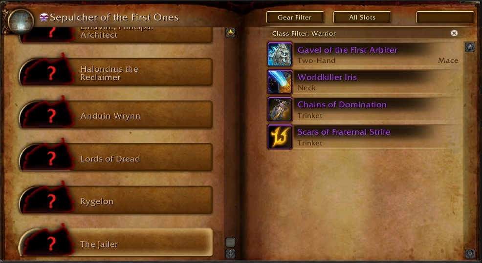

На PTR обновился Журнал подземелий и помимо прочего лута добавлен интересный предмет [Разрушитель Миров Ирис](https://ptr.wowhead.com/item=189859). И интересен он не столько эффектами сколько своей схожестью и лором с другим известным артефактом.  
 

Несмотря на отсутствие уникального эффекта эта шея имеет иконку [Сердца Азерот](https://wowhead.com/item=158075), Сердце Азерот было ключевым инструментом в деле *спасения* планеты и не являлось Разрушителем миров хотя и содержало [достаточно силы для уничтожения Древнего бога](https://www.youtube.com/watch?v=a_iHOJ1Ezr0).

Судя по той небольшой информации что имеется в журнале, битва с Зоваалом будет космического масштаба (надеюсь динозавры стреляющие лазерами примут участие) и решит судьбу Азерота. Судя по описаниям артефактов Разрушитель Миров не будет каким либо одушевленным орудием, это скорее инструмент противоположный Сердцу Азерот

**[Сердце Азерот](https://ru.wowhead.com/item=158075)**: *"Живой символ надежды, который носят защитники умирающей планеты. Судьбу Азерот разделят все ее дети."*
**[Разрушитель Миров Ирис](https://ptr.wowhead.com/item=189859)**: *"Живой символ отчаяния, рожденный возмездием проклятой предвечности. Судьбу Азерота разделят все ее дети."*

Хотя мы, игроки, казалось бы являемся героями этой истории, все мы знаем что WoW это история про NPC. Тюремщик — основной персонаж этого аддона и Ирис убивающий миры — это его Сердце Азерот. 