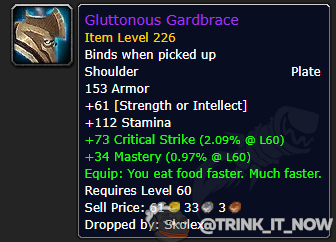

# Новые наплечи диетолога

В рамках историй о уникальных предметах из Гробницы Предвечных нашлись [Прожорливые наплечи](https://ptr.wowhead.com/item=189814), специальные латные наплечи с уникальным эффектом помогающим игроку кушать быстрее. Видимо секрет быстрого пищеварения кроется в сильных плечах.

[Неутолимая ненасытность](https://ptr.wowhead.com/spell=367892) имеет три эффекта влияющих на прием пищи: сокращает тики нажирания хп столба вдвое, удваивает количество хп восстанавливаемое каждым тиком и как следствие первого эффекта - сокращает время поедания в два раза. Итого столик [Пиршество гедонистического обжорства](https://ru.wowhead.com/item=172043) даст вам 96 154 хм и 76 924 маны за 10 секунд, вместо обычных 20. Это как раз тот самый критичный функционал который годами просили осваиватели ключей и благодаря ему отжирание между запулами сократится вдвое, тем самым уменьшит итоговый таймер. 

#news #ornot #raid #gear