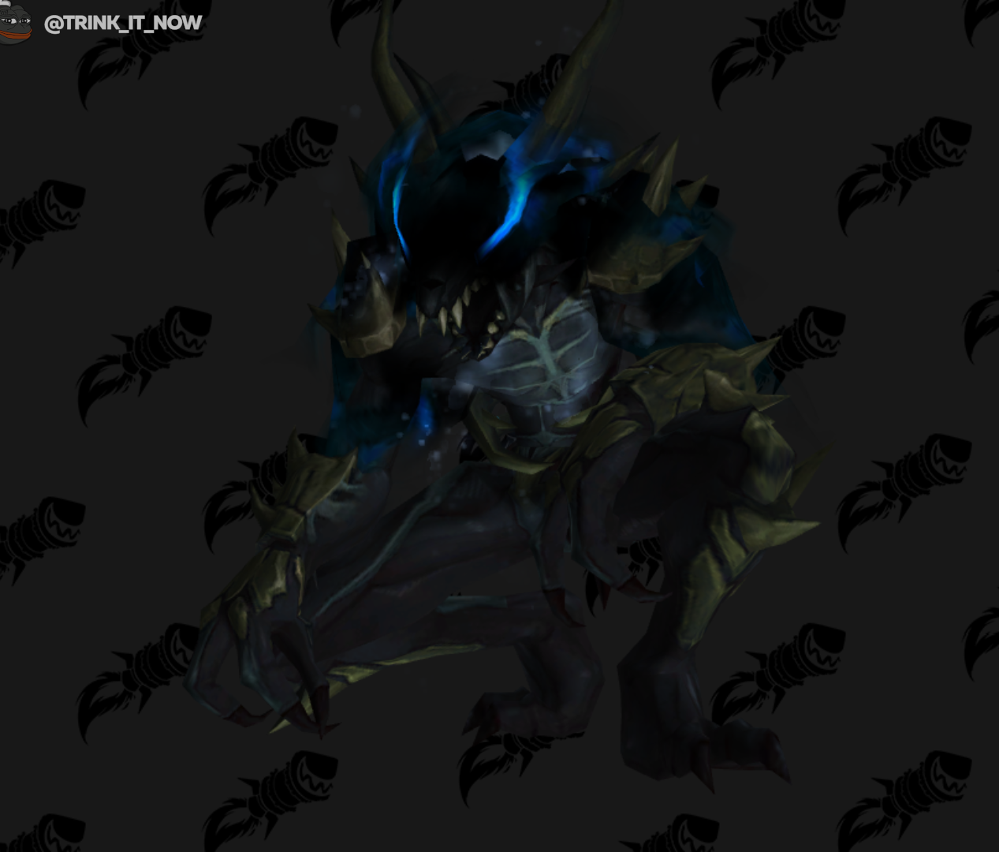

# В 9.2 Друстов из Тирны понерфят

В патче 9.2 [Друст - злобный коготь](https://ru.wowhead.com/npc=165111) будет понерфлен, облегчая игрокам пулл и [10% дебаффа на входящий урон](https://ru.wowhead.com/spell=322967/).

*[Последний вздох](https://ru.wowhead.com/spell=322968/) Умирая, проклинает игроков и существ в радиусе ~~30~~6 м, на ~~30~~20 sec. увеличивая получаемый ими урон на 10%.*  
***Время каста увеличено до 2с с инстакаста***

*[Кровопускание](https://ru.wowhead.com/spell=323020/) Прыгает к игроку, после чего рассекает игроков в радиусе 4 м, нанося 1979 ед. физического урона и еще 1484 ед. физического урона раз в 2 сек. в течение 8 sec.*  
***Добавлена минимальная дистанция в 10м***

Дебафф [Последнего вздоха](https://ru.wowhead.com/spell=322968/) был высокорисковым методом уничтожения паков так как дебафф на входящий урон приходился И на мобов в паке, что делало их уязвимимы тоже. А с планируемыми изменениями пати может выйти из зоны поражения дебаффа и даже удержать пак в этой зоне например монковским [Кругом мира](https://ru.wowhead.com/spell=116844/) или подобным CC.

[Кровопускание](https://ru.wowhead.com/spell=323020/) теперь тоже станет легче избежать просто выбежав из минимальной зоны поражения.

И все это вместе дает интересную стратегию фокуса на друсте и отбеганиии на моменте его смерти что выдаст урон в пак вокруг него.

#news #major #patch #dungeon #mots