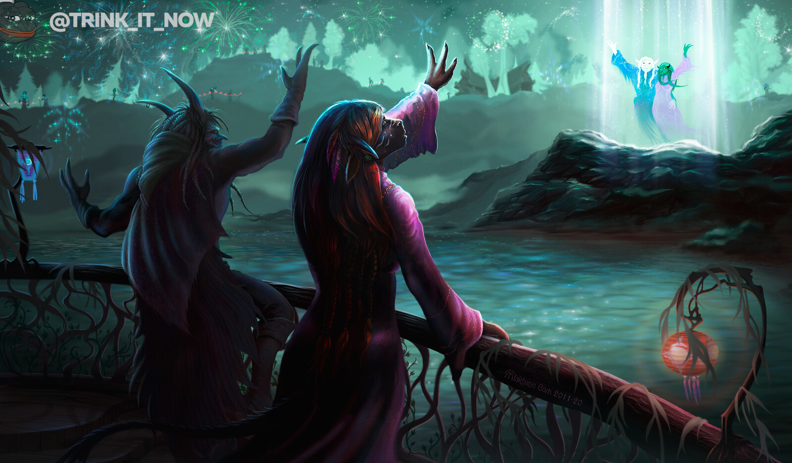

# Лунныый фестиваль 2022

В игре начался Лунный Фестиваль, который продлится с 30го января по 13е февраля. На этом празднике мы чтим память предков, получаем тайтл [Премудрый](https://ru.wowhead.com/title=74) и тратим [Монеты Наследия](https://ru.wowhead.com/item=21100) на разные праздничные акксессуары, такие как: 
- [Венки Лунного Фестиваля](https://ru.wowhead.com/items/armor/cosmetic#items;q=%D0%92%D0%B5%D0%BD%D0%BE%D0%BA) - цветочные венки, которые можно трансмогрифицировать и вне праздника после выполнения цепочки [Лунная консервация](https://ru.wowhead.com/quest=56842/)
- [Сборный костюм дракона](https://ru.wowhead.com/items/miscellaneous/other#q=%D0%B7%D0%B5%D0%BB%D0%B5%D0%BD%D0%BE%D0%B3%D0%BE%20%D0%B4%D1%80%D0%B0%D0%BA%D0%BE%D0%BD%D0%B0)
- [Празничные костюмы](https://ru.wowhead.com/items/armor/cosmetic#items;q=%D0%9F%D1%80%D0%B0%D0%B7%D0%B4%D0%BD%D0%B8%D1%87%D0%BD%D0%BE%D0%B5)  

И многое другое. Подробнее о празднике и луте с него можно [прочитать в гайде](https://ru.wowhead.com/lunar-festival-guide).

Арт от [Maxim Yershov](https://www.artstation.com/artwork/d88Bdx)

#news #events #yearly #lunarfestival